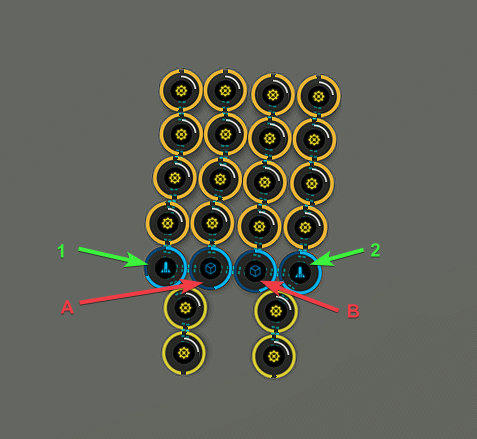

# Planetary Interaction Templates
## Fuel Block PI Templates

The fuel block PI templates attempts to use 3 factory planets to get all the P2s and P3s required for fuel block production. Command center upgrades V is required for this setup. For Fuel blocks, coolant is needed at about a 2:1 ratio to the mechanical parts/enriched Uranium requirements. Nothing is perfect in PI production and you will most likely have some left over. All 3 factories run for the same amount a time and get refreshed once per week.

Diagram:

### Robotics

Drop the following to Launchpad 1 and then transfer to Storage Unit A:

 - Precious Metals 52480 Units

Drop the following to Launchpad 2 and then transfer to Storage Unit B:

 - Chiral Structures 52480 Units

Drop the following to Launchpad 1:

 - Reactive Metals 52480 Units

Drop the following to Launchpad 2:

 - Toxic Metals 52480 Units

### Coolant

Drop the following to Launchpad 1 and then transfer to Storage Unit A:

 - Electrolytes 52400 Units

Drop the following to Launchpad 2 and then transfer to Storage Unit B:

 - Water 52400 Units

Drop the following to Launchpad 1:

 - Water 52400 Units

Drop the following to Launchpad 2:

 - Electrolytes 52400 Units

### Mechanical Parts / Enriched Uranium

Drop the following to Launchpad 1 and then transfer to Storage Unit A:

 - Reactive Metals 52400 Units

Drop the following to Launchpad 2 and then transfer to Storage Unit B:

 - Precious Metals 52400 Units

Drop the following to Launchpad 1:

 - Precious Metals 52400 Units

Drop the following to Launchpad 2:

 - Toxic Metals 52400 Units