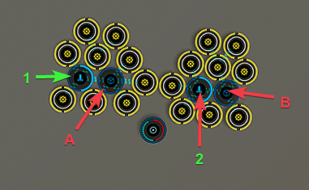

# Planetary Interaction Templates
## Misc PI Factories

The following are misc. PI setups that I use for various purposes like making parts for capitals ships. All factories here require Command Center Upgrades IV. all factories run for 164 hours or just over 6 days

Diagram:

### Nanites

Drop the following to Launchpad 1 and then transfer to Storage Unit A:

 - Bacteria 52560 Units

Drop the following to Launchpad 2 and then transfer to Storage Unit B:

 - Reactive Metals 52560 Units

Drop the following to Launchpad 1:

 - Reactive Metals 52560 Units

Drop the following to Launchpad 2:

 - Bacteria 52560 Units

### Enriched Uranium

Drop the following to Launchpad 1 and then transfer to Storage Unit A:

 - Toxic Metals 52560 Units

Drop the following to Launchpad 2 and then transfer to Storage Unit B:

 - Precious Metals 52560 Units

Drop the following to Launchpad 1:

 - Precious Metals 52560 Units

Drop the following to Launchpad 2:

 - Toxic Metals 52560 Units

### Consumer Electronics

Drop the following to Launchpad 1 and then transfer to Storage Unit A:

 - Toxic Metals 52560 Units

Drop the following to Launchpad 2 and then transfer to Storage Unit B:

 - Chiral Structures 52560 Units

Drop the following to Launchpad 1:

 - Chiral Structures 52560 Units

Drop the following to Launchpad 2:

 - Toxic Metals 52560 Units

### Test Cultures

Drop the following to Launchpad 1 and then transfer to Storage Unit A:

 - Bacteria 52560 Units

Drop the following to Launchpad 2 and then transfer to Storage Unit B:

 - Water 52560 Units

Drop the following to Launchpad 1:

 - Water 52560 Units

Drop the following to Launchpad 2:

 - Bacteria 52560 Units

### Viral Agent

Drop the following to Launchpad 1 and then transfer to Storage Unit A:

 - Bacteria 52560 Units

Drop the following to Launchpad 2 and then transfer to Storage Unit B:

 - Biomass 52560 Units

Drop the following to Launchpad 1:

 - Biomass 52560 Units

Drop the following to Launchpad 2:

 - Bacteria 52560 Units

### Miniature Electronics

Drop the following to Launchpad 1 and then transfer to Storage Unit A:

 - Silicon 52560 Units

Drop the following to Launchpad 2 and then transfer to Storage Unit B:

 - Chiral Structures 52560 Units

Drop the following to Launchpad 1:

 - Chiral Structures 52560 Units

Drop the following to Launchpad 2:

 - Silicon 52560 Units

### Supertensile Plastics

Drop the following to Launchpad 1 and then transfer to Storage Unit A:

 - Oxygen 52560 Units

Drop the following to Launchpad 2 and then transfer to Storage Unit B:

 - Biomass 52560 Units

Drop the following to Launchpad 1:

 - Biomass 52560 Units

Drop the following to Launchpad 2:

 - Oxygen 52560 Units
