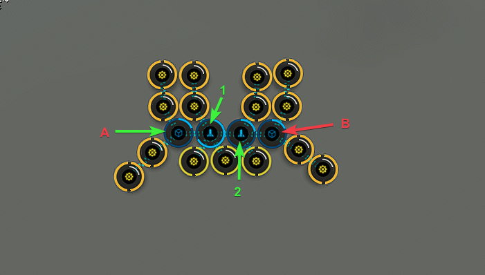

# Planetary Interaction Templates
## Mobile Structure PI

The mobile structure PI templates attempts to use 4 factory planets to get all the P3s required for mobile depot production. Command center upgrades IV is required for this setup. All 4 factories run for the same amount a time and get refreshed once per week. 219 hours to be exact.

Diagram:

### Smartfab Units

Drop the following to Launchpad 1 and then transfer to Storage Unit A:

 - Chiral Structures 52560 Units

Drop the following to Launchpad 2 and then transfer to Storage Unit B:

 - Toxic Metals 52560 Units

Drop the following to Launchpad 1:

 - Silicon 52560 Units

Drop the following to Launchpad 2:

 - Reactive Metals 52560 Units

### Nuclear Reactors

Drop the following to Launchpad 1 and then transfer to Storage Unit A:

 - Toxic Metals 52560 Units

Drop the following to Launchpad 2 and then transfer to Storage Unit B:

 - Silicon 52560 Units

Drop the following to Launchpad 1:

 - Precious Metals 52560 Units

Drop the following to Launchpad 2:

 - Industrial Fibers 52560 Units

### Guidance Systems

Drop the following to Launchpad 1 and then transfer to Storage Unit A:

 - Water 52560 Units

Drop the following to Launchpad 2 and then transfer to Storage Unit B:

 - Chiral Structures 52560 Units

Drop the following to Launchpad 1:

 - Reactive Metals 52560 Units

Drop the following to Launchpad 2:

 - Plasmoids 52560 Units

### High-Tech Transmitters

Drop the following to Launchpad 1 and then transfer to Storage Unit A:

 - Chiral Structures 52560 Units

Drop the following to Launchpad 2 and then transfer to Storage Unit B:

 - Oxidizing Compound 52560 Units

Drop the following to Launchpad 1:

 - Plasmoids 52560 Units

Drop the following to Launchpad 2:

 - Industrial Fibers 52560 Units
