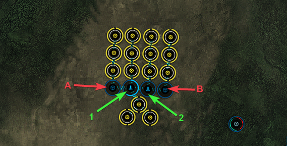
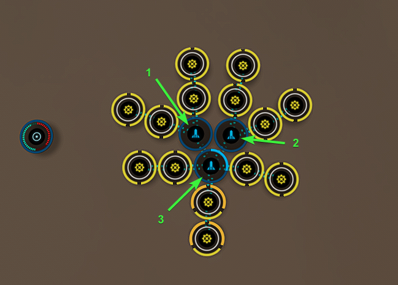

# Planetary Interaction Templates
## Nanite Repair paste Factories

The following are 3 factories for the PI needed for Nanite repair paste. All factories here require Command Center Upgrades IV. Nanites and Gel-Matrix Biopaste run for 1 week, the Data chips factory runs longer, for 1.25 weeks. These setups are not balanced.

Diagram:

### Nanites

Drop the following to Launchpad 1 and then transfer to Storage Unit A:

 - Bacteria 52560 Units

Drop the following to Launchpad 2 and then transfer to Storage Unit B:

 - Reactive Metals 52560 Units

Drop the following to Launchpad 1:

 - Reactive Metals 52560 Units

Drop the following to Launchpad 2:

 - Bacteria 52560 Units

## Misc P3 Planets

Making Data chips using Command Center Upgrades IV characters, runs for 1.25 weeks 

### Data Chips

Drop the following to Launchpad 1 and then transfer to Storage Unit A:

 - Biomass 52560 Units

Drop the following to Launchpad 2 and then transfer to Storage Unit B:

 - Silicon 52560 Units

Drop the following to Launchpad 1:

 - Oxygen 52560 Units

Drop the following to Launchpad 2:

 - Industrial Fibers 52560 Units

## Other Misc P3 Factory

Making Gel-Matrix Biopaste here using Command Center Upgrades IV Characters, runs for 1 week

### Gel-Matrix Biopaste

Drop the following to Launchpad 1

 - Plasmoids 26240 Units
 - Water 26240 Units

Drop the following to Launchpad 2 

 - Oxidizing Compound 26240 Units
 - Oxygen 26240 Units

Drop the following to Launchpad 3:

 - Biofuels 26240 Units
 - Precious Metals 26240 Units

