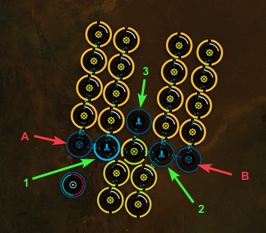
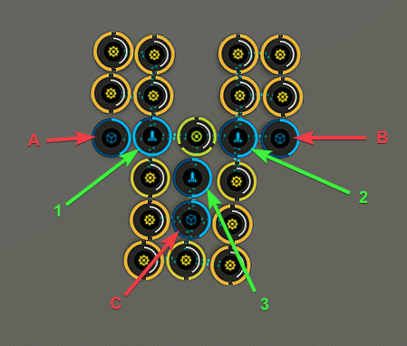
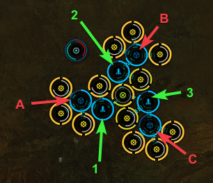

# Planetary Interaction Templates
## P1 to P4 templates

The templates shared below are of my own design and as such require expediated transfers and 2 trips to the poco/skyhook in order to not over fill the poco/skyhook

P4 planetary interaction in Eve Online requires that we break up the 8 different types of P4 into 3 different categories:

## Small P4

This category is for P4s that use a P1 as a direct input and 2 P3s made from 2 P2s each. In this category is Nano-factory, Organic Motar Applicators and Sterile Conduits

The template for these P4s can produce 1 P4 per hour, and will run for approximately a week, 164 Hours to be more exact

The following is an image that will be referred to for setup. The template is the same for each of these P4s just the materials you drop to each Launchpad is different.

### Nano-Factory

Drop the following to Launchpad 1 and then transfer to Storage Unit A:

 - Bacteria 26240 Units
 - Proteins 26240 Units

Drop the following to Launchpad 2 and then transfer to Storage Unit B:

 - Plasmoids 26240 Units
 - Water 26240 Units

Drop the following to Launchpad 1:

 - Biofuels 26240 Units
 - Industrial Fibers 26240 Units

Drop the following to Launchpad 2:

 - Oxygen 26240 Units
 - Electrolytes 26240 Units

Drop the following to Launchpad 3:

 - Reactive Metals 6560 Units

### Organic Motar Applicators

Drop the following to Launchpad 1 and then transfer to Storage Unit A:

 - Reactive Metals 26240 Units
 - Precious Metals 26240 Units

Drop the following to Launchpad 2 and then transfer to Storage Unit B:

 - Oxygen 26240 Units
 - Oxiding Compound 26240 Units

Drop the following to Launchpad 1:

 - Toxic Metals 26240 Units
 - Chiral Structures 26240 Units

Drop the following to Launchpad 2:

 - Water 26240 Units
 - Electrolytes 26240 Units

Drop the following to Launchpad 3:

 - Bacteria Metals 6560 Units 

### Sterile Conduits

Drop the following to Launchpad 1 and then transfer to Storage Unit A:

 - Silicon 26240 Units
 - Chiral Structures 26240 Units

Drop the following to Launchpad 2 and then transfer to Storage Unit B:

 - Proteins 26240 Units
 - Biofuels 26240 Units

Drop the following to Launchpad 1:

 - Toxic Metals 26240 Units
 - Reactive Metals 26240 Units

Drop the following to Launchpad 2:

 - Biomass 26240 Units
 - Bacteria 26240 Units

Drop the following to Launchpad 3:

 - Water 6560 Units 

## Medium P4

This category is for P4s that use 3 P3s made from 2 P2s each. In this category is Broadcast Node, Recursive Computing Module, and Self-Harmonizing Power Core

The template for these P4s can produce 0.5 P4 per hour, and will run for approximately 2 weeks, 328 Hours to be more exact

The following is an image that will be referred to for setup. The template is the same for each of these P4s just the materials you drop to each Launchpad is different.

### Broadcast Node

Trip 1:

Drop the following to Launchpad 1 and then transfer to Storage Unit A:

 - Oxygen 26240 Units
 - Biomass 26240 Units

Drop the following to Launchpad 2 and then transfer to Storage Unit B:

 - Precious Metals 26240 Units
 - Biofuels 26240 Units

Drop the following to Launchpad 3 and then transfer to Storage Unit C:

 - Oxidizing Compound 26240 Units
 - Industrial Fibers 26240 Units

Trip 2:

Drop the following to Launchpad 1:

 - Silicon 26240 Units
 - Indusrial Fibers 26240 Units

Drop the following to Launchpad 2:

 - Silicon 26240 Units
 - Oxidizing Compound 26240 Units

Drop the following to Launchpad 3:

 - Plasmoids 26240 Units
 - Chiral Structures 26240 Units

### Recursive Computing Module

Trip 1:

Drop the following to Launchpad 1 and then transfer to Storage Unit A:

 - Oxygen 26240 Units
 - Biomass 26240 Units

Drop the following to Launchpad 2 and then transfer to Storage Unit B:

 - Water 26240 Units
 - Reactive Metals 26240 Units

Drop the following to Launchpad 3 and then transfer to Storage Unit C:

 - Precious Metals 26240 Units
 - Biofuels 26240 Units

Trip 2:

Drop the following to Launchpad 1:

 - Water 26240 Units
 - Bacteria 26240 Units

Drop the following to Launchpad 2:

 - Plasmoids 26240 Units
 - Chiral Structures 26240 Units

Drop the following to Launchpad 3:

 - Precious Metals 26240 Units
 - Biofuels 26240 Units

### Recursive Computing Module

Trip 1:

Drop the following to Launchpad 1 and then transfer to Storage Unit A:

 - Silicon 26240 Units
 - Oxidizing Compound 26240 Units

Drop the following to Launchpad 2 and then transfer to Storage Unit B:

 - Silicon 26240 Units
 - Industrial Fibers 26240 Units

Drop the following to Launchpad 3 and then transfer to Storage Unit C:

 - Proteins 26240 Units
 - Biomass 26240 Units

Trip 2:

Drop the following to Launchpad 1:

 - Plasmoids 26240 Units
 - Electrolytes 26240 Units

Drop the following to Launchpad 2:

 - Toxic Metals 26240 Units
 - Precious Metals 26240 Units

Drop the following to Launchpad 3:

 - Oxidizing Compound 26240 Units
 - Industrial Fibers 26240 Units

## Large P4

This category is for P4s that use 3 P3s made from 3 P2s each. In this category is Integrity Response Drones and Wetware Mainframe

The template for these P4s can produce 0.25 P4 per hour, and will run for approximately 2.5 weeks, 436 Hours to be more exact

The following is an image that will be referred to for setup. The template is the same for each of these P4s just the materials you drop to each Launchpad is different.

### Integrity Response Drones

Trip 1:

Drop the following to Launchpad 1 and then transfer to Storage Unit A:

 - Oxygen 17440 Units
 - Plasmoids 17440 Units
 - Water 17440 Units

Drop the following to Launchpad 2 and then transfer to Storage Unit B:

 - Plasmoids 17440 Units
 - Biofuels 17440 Units
 - Industrial Fibers 17440 Units

Drop the following to Launchpad 3 and then transfer to Storage Unit C:

 - Biomass 17440 Units
 - Oxygen 17440 Units
 - Precious Metals 17440 Units

Trip 2:

Drop the following to Launchpad 1:

 - Oxidizing Compound 17440 Units
 - Biofuels 17440 Units
 - Precious Metals 17440 Units

Drop the following to Launchpad 2:

 - Chiral Structures 17440 Units
 - Bacteria 17440 Units
 - Biomass 17440 Units

Drop the following to Launchpad 3:

 - Reactive Metals 17440 Units
 - Chiral Structures 17440 Units
 - Silicon 17440 Units

### Wetware mainframe

Trip 1:

Drop the following to Launchpad 1 and then transfer to Storage Unit A:

 - Water 34880 Units
 - Reactive Metals 17440 Units

Drop the following to Launchpad 2 and then transfer to Storage Unit B:

 - Reactive Metals 34880 Units
 - Toxic Metals 17440 Units

Drop the following to Launchpad 3 and then transfer to Storage Unit C:

 - Bateria 34880 Units
 - Proteins 17440 Units

Trip 2:

Drop the following to Launchpad 1:

 - Toxic Metals 17440 Units
 - Chiral Structures 17440 Units
 - Electrolytes 17440 Units

Drop the following to Launchpad 2:

 - Bacteria 17440 Units
 - Biofuels 17440 Units
 - Proteins 17440 Units

Drop the following to Launchpad 3:

 - Water 17440 Units
 - Electrolytes 17440 Units
 - Oxygen 17440 Units
